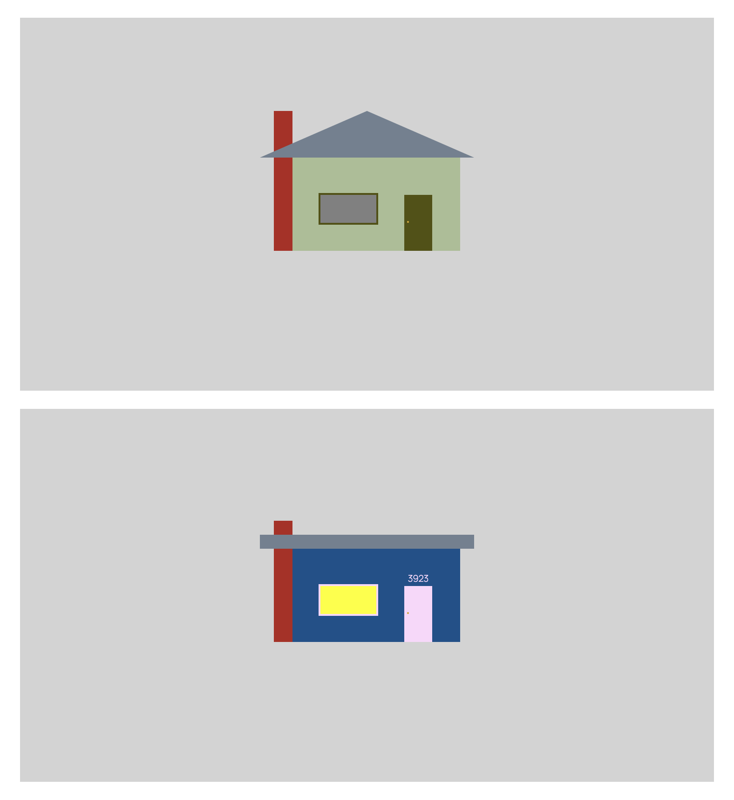

# House Block

This is exists as a basic testing ground for a WordPress block. Build a house.

1. Change house color
2. Change trim color
3. Change roof shape
4. Add house number
5. Toggle interior light
